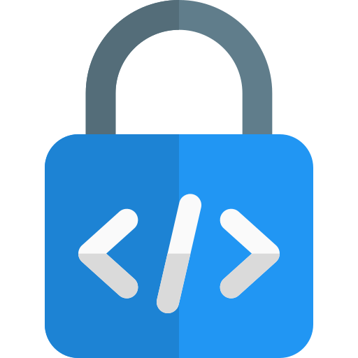

# 🔒 DualCrypt

[](LICENSE)


## 📖 Overview
**DualCrypt** is a tool for **HTML source code protection and obfuscation**.

It supports:
- **CLI** (command line usage)
- **Interactive mode** (menu-based)
- **GUI** with Tkinter (logs, progress bar, theme, export logs, open folder, file selection)

---

## 🚀 Features
- Encoding modes: **Percent**, **Base64**, **Dual (Percent + Base64)**
- Options: **Minify**, **Protection** (disable right-click, Ctrl+U, F12)
- GUI features: Light/Dark theme, progress bar, logs, export logs, open folder, subset file selection

---

## ⚙️ Usage

### CLI
```bash
python dualcrypt.py --src src --dst dist --mode dual
```

### Interactive Mode
```bash
python dualcrypt.py --interactive
```

### GUI
Windows:
```bat
RUN_DUALCRYPT_WINDOWS.bat
```
Linux / macOS:
```bash
./run_dualcrypt_unix.sh
```

---

## 🛠️ Build Executable with PyInstaller (Windows)
```bash
pip install pyinstaller
pyinstaller --noconfirm --windowed --icon "icons/pyinstaller_dualcrypt.ico" dualcrypt.py
```

---

## 👨‍💻 Developer
- **Knightnum Limited**
- Website: [https://knightnum.online](https://knightnum.online)

## 📸 Screenshots

### DualCrypt GUI

